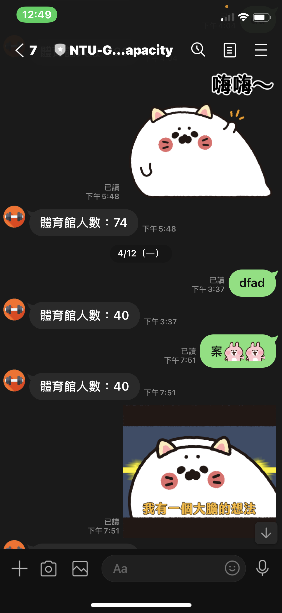

# NTU-Gym-Line-Bot-Integration

> Public Code for Non-Official NTU Gym Real-time Monitor Line Bot

It is not surprising that people go to the gym and are rejected due to the capacity contraint. To deal with this problem, we develop a line bot that can tell users the real-time information about the gym. With current capacity, they can decide the exercising time without going to the gym in vain. This project is developed using Django and wrapped by docker-compose. We also use ngrox to get an instantly https address for Line API.

🤖 The project is temporarily stopped developing due to the Covid-19 (the gym is closed now). We will re-start the project once the gym is on.




## Usage

These instructions will help you develop an “almost” same line-bot. 

1. Download the source code

```
git clone https://github.com/KaiChen1008/ntu-gym-line-bot-integration
```

2. Follow the [instruction1](https://www.docker.com/get-started)  and [instruction2](https://docs.docker.com/compose/install/) to install docker and docker-compose.
3. Follow the [instruction](https://developers.line.biz/en/docs/line-developers-console/login-account/#log-in-to-line-developers-console) to enroll as a line developer.
4. Once you finished the enrollment, you will get your own api private key. What you have to is to paste the key in `line-bot-server/bot-server/main-server/settings.py`

```
# Line bot setting

LINE_CHANNEL_ACCESS_TOKEN   = 'xxxxxx'
LINE_CHANNEL_SECRET         = 'xxxx'
```

5. Start the services

```
cd line-bot-server
docker-compose .
```

6. After the service started, please paste the generated instant address to line bot webpage (under Message API tab)


## ToDo

- [ ] Collecting data for analyzing
- [ ] Predict the capacity of a specific time
- [ ] Personalize the responses for each user
